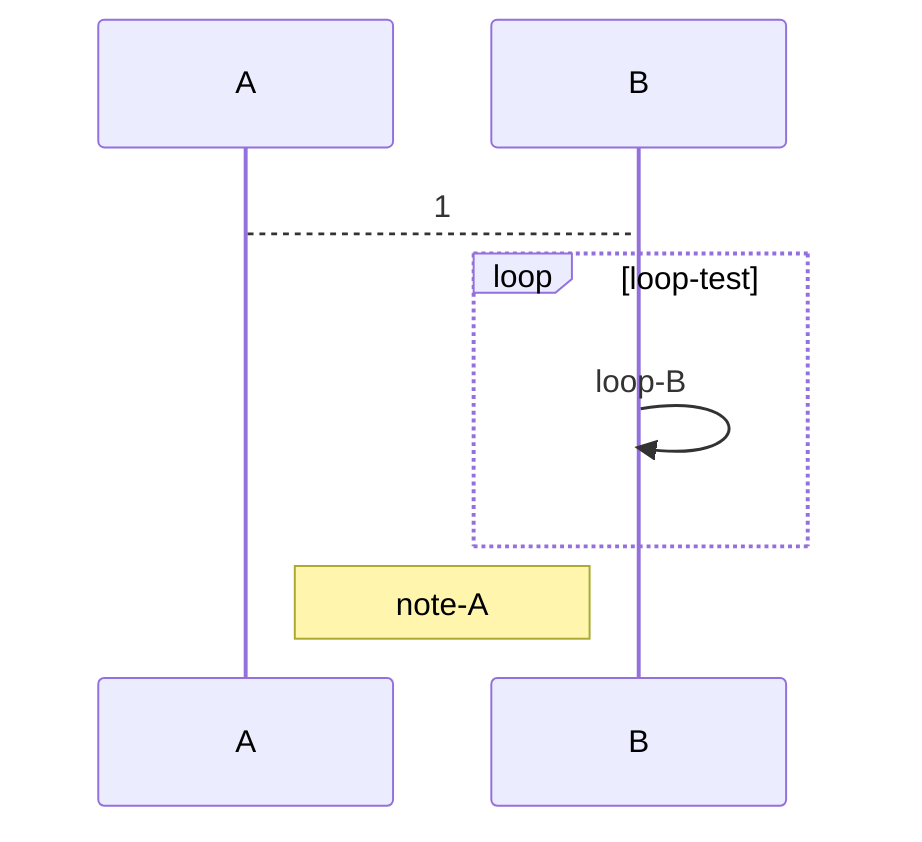

#mermaid #learn #self-improvement 
# Flowchats
All Flowcharts are composed of nodes,the geometric shapes and edges,the arrows or lines.The mermaid code defines the way that these nodes and edges are made and interact
It can also accommodate different arrow types,multi directional arrows,and linking to and form subgraphs.
# sequenceDiagram

# Gantt diagram
```mermaid
gantt
dateFormat YYYY-MM-DD
title HuaXiaLongHui Analysis
excludes weekdays

section PDF Analysis
Analyse the slx:activate,
```

